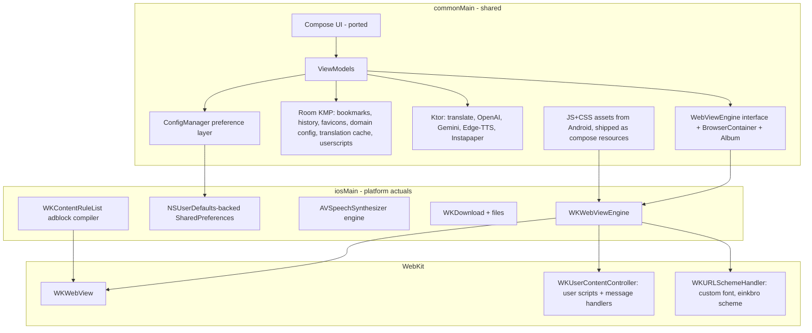

# EinkBro → iOS feature migration plan

Status: adopted 2026-07-16. Scope: turn the ported UI catalog into a working
e-ink-oriented browser on iOS with feature parity where the platform allows it,
and documented divergence where it does not.

The plan is grounded in a full inventory of the Android browser layer
(EBWebView + helpers, 40+ JS/CSS assets, tab model, services, persistence).
Guiding principles:

1. **Common-first.** Everything that is pure Kotlin or JS stays in `commonMain`
   and is shared verbatim: the UI (done), the preference layer (done), the JS
   asset pipeline, view models, translation/AI/TTS protocol code.
2. **The Web layer is a seam, not a rewrite.** Android's `EBWebView` is mostly a
   *dispatcher* into JS assets and config. iOS gets a `WebViewEngine` interface
   in common code with a WKWebView actual; the JS assets are reused unchanged
   wherever possible.
3. **Replace shims bottom-up, keep the catalog.** In-memory SharedPreferences →
   NSUserDefaults; no-op Room shim → real Room KMP; stubs → real services. The
   UI catalog remains reachable (debug menu) as a living style guide.

## Target architecture

The bridge that makes JS features portable: Android's `@JavascriptInterface`
objects (`JsWebInterface`, `einkbroGM`, `AndroidInterface`) become
`WKScriptMessageHandler`s; a small JS prelude maps the existing global names to
`webkit.messageHandlers.*.postMessage`, so the 40+ asset scripts stay untouched.

## Platform capability mapping

The hard constraints, decided up front:

| Android mechanism | iOS equivalent | Consequence |
|---|---|---|
| `shouldInterceptRequest` (per-request hook) | **None** in WKWebView | The single biggest divergence — see items below |
| → adblock network blocking (Brave C++ engine) | `WKContentRuleList` (declarative, compiled JSON) | Convert EasyList→content-blocker JSON; cosmetic/element-hiding via injected CSS. Native `adblock-client` is dropped |
| → e-ink DEEP image re-encoding | Not possible | **FAST mode only** (CSS `filter` on images) — accepted loss |
| → custom-font serving (`mycustomfont`) | `WKURLSchemeHandler` | Works (custom schemes may be handled) |
| `@JavascriptInterface` bridges | `WKScriptMessageHandler` + JS prelude | Mechanical re-plumb; async replies via `evaluateJavaScript` callbacks |
| `addDocumentStartJavaScript` / onPageStarted-Finished injection | `WKUserScript` (.atDocumentStart/.atDocumentEnd, all frames) | Direct equivalent |
| `WebView.saveWebArchive` (MHT) | `createWebArchiveData` (.webarchive) | Format divergence: saved pages become webarchive; MHT files can't be opened |
| `createPrintDocumentAdapter` (PDF) | `WKWebView.createPDF` + PDFKit for ToC/merge | PdfBox → PDFKit |
| Volume-key paging | No public API | **Dropped**; touch areas + hardware-keyboard paging cover it |
| forceDark / algorithmic darkening | None | CSS-filter dark mode (invert + hue-rotate), same as EinkBro's invert path |
| System TTS | `AVSpeechSynthesizer` | Direct equivalent |
| `DownloadManager` | `WKDownload` (iOS 14.5+) + FileManager | Blob-download JS hook reused as-is |
| OkHttp / HttpURLConnection / Jsoup | Ktor (Darwin engine) / Ksoup | All service code moves to Ktor in common |
| Room (Android) | **Room KMP 2.7** (bundled SQLite) | Entities/DAOs reused with minor changes; replaces the no-op annotation shim |
| SharedPreferences | The existing shim, backed by `NSUserDefaults` | One-file change in `iosMain` |
| Intents/share/shortcuts | Share extension, `UIApplicationShortcutItem`, custom URL scheme `einkbro://` | Later phase |
| PiP / fullscreen video | WKWebView inline media + `isElementFullscreenEnabled` | Direct |
| Find on page | `UIFindInteraction` (iOS 16) | Direct |

## Feature-parity matrix

Legend: ✅ direct port · 🔧 platform reimplementation · ⚠️ partial parity · ❌ dropped (documented)

### Core browsing (Phase 1)
| Feature | iOS approach | Status |
|---|---|---|
| Tabs (BrowserContainer/AlbumController/Album) | Same classes over WebViewEngine; Album already ported | ✅ |
| Navigation, refresh, back/forward | WKWebView APIs | ✅ |
| URL bar + search engines + suggestions | Ported UI + SearchEngine enum (done) | ✅ |
| Page up/down (3 mechanisms) | JS `__einkbroPageScroll` (`fix_scrolling.js`) + scroll fallback; key events n/a | ⚠️ (2 of 3) |
| Touch-area tap paging | Compose overlay zones calling page JS (replaces dispatchTouchEvent) | 🔧 |
| History recording | Room KMP `HISTORY` table | ✅ (Phase 2) |
| Popups/new window, Google/FB login windows | WKUIDelegate `createWebViewWith` → new Album | 🔧 |
| Offline error page + einkbro://retry | Same HTML via loadHTMLString + WKURLSchemeHandler | ✅ |
| Custom UA / desktop mode | `customUserAgent` per tab, per-site override | ✅ |
| Incognito | Ephemeral `WKWebsiteDataStore` per tab | 🔧 |
| SSL errors / HTTP auth | `didReceiveAuthenticationChallenge` + ported auth dialog | 🔧 |

### Content pipeline (Phase 3)
| Feature | iOS approach | Status |
|---|---|---|
| CSS slot system (`update_css_slot.js`) | Same JS via evaluateJavaScript | ✅ |
| Reader mode (MozReadability) | Same JS assets | ✅ |
| Vertical CJK reading + line-advance snapping | Same JS/CSS assets | ✅ |
| Two-column landscape reader | Same CSS | ✅ |
| Font injection incl. custom TTF | CSS slots + WKURLSchemeHandler font serving | ✅ |
| Bold/black-font/white-bg | CSS slots | ✅ |
| Dark mode / invert | CSS filter slot (no forceDark) | ⚠️ |
| E-ink image adjustment | FAST (CSS filter) only; DEEP dropped | ⚠️ |
| Viewport width overrides, text reflow on zoom | Same JS | ✅ |
| Autoplay blocker, audio-only mode, auto-fullscreen | Same JS via WKUserScript | ✅ |
| DNS prefetch hints, GitHub fragment expansion, DSD fix | Same JS | ✅ |

### Privacy & blocking (Phase 4)
| Feature | iOS approach | Status |
|---|---|---|
| Adblock network rules (ABP lists) | EasyList→WKContentRuleList converter, compiled at list install | ⚠️ (rule-count caps, no dynamic rules) |
| Element hiding / cosmetic filters / scriptlets | Injected CSS/JS from parsed lists (subset) | ⚠️ |
| Adblock/JS/Cookie per-domain whitelists | Same BaseWebConfig over Room; JS toggle via `WKWebpagePreferences.allowsContentJavaScript` per navigation | ✅ |
| Analytics fast-block list | Fold into content rule list | ✅ |
| Per-site settings (DomainConfiguration) | Same manager (already ported), enforced at navigation | ✅ |
| Clear-on-exit | `WKWebsiteDataStore.removeData` | 🔧 |

### Interaction (Phase 5)
| Feature | iOS approach | Status |
|---|---|---|
| Text selection bridge, sentence/paragraph select, selection+context | Same JS + message handlers | ✅ |
| Highlights (span injection + Room articles/highlights) | Same JS + Room KMP | ✅ |
| ActionMode menu (ported UI) over selection | `UIEditMenuInteraction` suppression + Compose menu at selection rect | 🔧 |
| Link long-press context menu (ported UI) | WKUIDelegate contextMenu APIs → ported ContextMenuDialog | 🔧 |
| Swipe gestures → 23 GestureType actions | Compose pointer input on chrome + edge zones (mapped, already-ported picker) | 🔧 |
| Vim keyboard bindings, DPAD paging | `UIKeyCommand`/Compose key events (hardware keyboards) | ✅ |
| Volume-key paging | — | ❌ |
| Find on page (ported search bar) | UIFindInteraction or JS-based highlight search | 🔧 |
| Split screen / two-pane | Compose Row with two engine holders | 🔧 |
| Pinch zoom text reflow | Same JS on scroll-scale events | ⚠️ |

### Services (Phase 6)
| Feature | iOS approach | Status |
|---|---|---|
| Translation: Google/DeepL/Papago/Naver endpoints | Ktor port of TranslateRepository (HMAC signing is pure Kotlin) | ✅ |
| In-place paragraph translation + node monitor | Same JS assets + message handler + Room translation cache | ✅ |
| Google Translate widget injection | Same JS | ✅ |
| Papago image OCR translate | Ktor + same overlay JS | ✅ |
| OpenAI/Gemini chat + streaming (SSE), tool-calling agent | Ktor SSE in common; chat.html + ChatWebInterface bridge | ✅ |
| GPT actions / summarize / chat-with-web (UI ported) | Wire to Ktor repository | ✅ |
| TTS: system | AVSpeechSynthesizer actual | 🔧 |
| TTS: Edge-TTS (WebSocket + SSML) | Ktor WebSocket + AVAudioPlayer; token gen is pure crypto | ✅ |
| TTS: OpenAI | Ktor + AVAudioPlayer | ✅ |
| TTS media controls | MPNowPlayingInfoCenter / remote command center | 🔧 |
| Instapaper | Ktor | ✅ |

### Files & export (Phase 7)
| Feature | iOS approach | Status |
|---|---|---|
| Downloads (incl. blob/data URL) | WKDownload + reused blob JS hooks | ✅ |
| Save as PDF + ToC + append/merge | `createPDF` + PDFKit (replaces PdfBox) | 🔧 |
| Web archive (was MHT) | `createWebArchiveData`; MHT open dropped | ⚠️ |
| Saved pages (offline, UI ported) | webarchive files + Room `saved_pages` | ✅ |
| EPUB save/append/ToC | Minimal EPUB writer (zip+OPF) in common; epublib dropped | 🔧 |
| EPUB reader | Later: custom parser is mostly pure Kotlin; render via same reader pipeline | 🔧 (deferred) |
| Backup/restore ZIP, Chrome bookmarks HTML import/export | Same format; UIDocumentPicker for file access | ✅ |
| LAN file sharing (Sharik protocol) | Ktor server (CIO) on iOS | ⚠️ (verify engine support) |
| Save image to gallery | PHPhotoLibrary | 🔧 |

### Platform integration (Phase 8)
Share extension (ACTION_SEND equivalent), quick actions (shortcuts),
`einkbro://` URL scheme + universal links, `.epub`/`.webarchive` file
associations, home-screen icon per site (n/a → Safari-style bookmarks only ❌),
app icon/launch screen, iPad layout (isWideLayout currently stubbed false),
App Store packaging. DictActivity/Pocket/colordict integrations: ❌ (Android-only apps).

## Persistence & infrastructure decisions

- **Preferences**: keep the `android.content.SharedPreferences` shim API, back it
  with `NSUserDefaults` via a small expect/actual (`createPlatformPreferences()`).
  Zero changes to the ported preference layer. Session-restore of open tabs uses
  the same `AlbumInfo` JSON prefs as Android.
- **Database**: adopt **Room KMP** (androidx.room 2.7.x + sqlite-bundled + KSP).
  The Android schema (14 entities, v10) is reused; the no-op `androidx.room`
  shim is deleted in the same change. Data migration from Android is *not*
  needed (fresh platform); schema version restarts at 1 with the same shape.
- **Networking**: Ktor 3.x with Darwin engine in `iosMain`, shared repositories
  in common. SSE via ktor-client plugins; WebSocket for Edge-TTS.
- **JS assets**: copy `app/src/main/assets/*.js|css|html` into
  `composeResources/files/`, loaded via `Res.readBytes` and installed as
  `WKUserScript`s / evaluated on demand. A generated prelude maps
  `window.searchBoxJavaBridge_`-style globals to message handlers.
- **DI**: Koin (already present) gains modules per service as they become real.

## Phased roadmap

| Phase | Deliverable | Exit criteria |
|---|---|---|
| **1. Browser shell** | WebViewEngine + WKWebView actual, real tabs behind Album, toolbar/URL-bar/tab-overview wired, JS paging, touch areas, app launches into browser (catalog in menu) | Browse real sites, manage tabs, page-turn by tap on simulator |
| **2. Persistence** | NSUserDefaults prefs, Room KMP swap, history/bookmarks/favicons real, tab session restore | Settings + bookmarks + history survive relaunch |
| **3. Content pipeline** | CSS slots, fonts, reader mode, vertical reading, dark/eink filters, autoplay/audio-only | Reader + vertical mode verified on CJK article |
| **4. Privacy & blocking** | Content-rule adblock, whitelists, incognito, per-site settings enforcement, UA switch | EasyList blocks ads on test page; incognito leaves no trace |
| **5. Interaction** | Selection/highlights, context menus, gestures, find-on-page, split screen, keyboard | Long-press menus + highlight flow work end-to-end |
| **6. Services** | Translation providers, TTS engines, AI features on Ktor | Translate-by-paragraph + read-aloud + GPT summarize work |
| **7. Files & export** | Downloads, PDF, webarchive, saved pages, EPUB save, backup | Save-as-PDF with ToC; offline page reopens |
| **8. Platform polish** | Share ext, scheme, file associations, iPad, App Store prep | TestFlight build |

Each phase ends with: build green, simulator verification pass, commit + ADR.

## Top risks

1. **No `shouldInterceptRequest`** — bounded: the three affected features have
   explicit fallbacks (content rules / FAST mode / scheme handler).
2. **Content-blocker rule limits** (~150k rules/list, no regex bodies) — split
   lists, prioritize EasyList core; measure real-world block rate.
3. **JS-bridge re-plumb surface** — many small handlers; mitigated by the
   prelude shim keeping asset JS untouched, and by porting bridge-by-bridge with
   the features that use them.
4. **Room KMP + KSP build integration** — do it as an isolated Phase-2 change;
   fall back to SQLDelight if KSP fights the toolchain.
5. **Edge-TTS token scheme drift** — same risk Android has; isolate behind the
   TTS engine interface.
