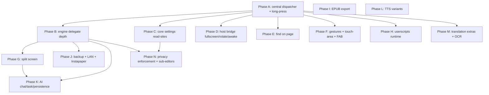

# EinkBro iOS — Full Feature-Parity Plan (toolbar, menus, settings)

Status: drafted 2026-07-17. This plan takes the port from "the 8 structural phases
compile and the happy paths work" to **actual feature parity** with the Android
app across the three surfaces the user drives every day: the **toolbar** (every
action, click *and* long-press), the **menus** (main menu, link context menu,
bookmark/record context menu), and **Settings** (every screen, every toggle).

It is written to be handed to fresh sessions one phase at a time. Each phase lists
the files to touch, the Android reference (so behavior can be copied precisely),
and a verification step.

Reference sources:
- Android originals: `/Users/maoyuankao/src/einkbro`
  - Toolbar dispatch: `app/.../view/handlers/ToolbarActionHandler.kt` (`handleClick` L52-101, `handleLongClick` L25-50)
  - Menu dispatch: `app/.../view/handlers/MenuActionHandler.kt` (`handle`, `handleLongClick`)
  - Action implementations: `app/.../activity/BrowserActivity.kt` (`when(BrowserAction)` L493-564; impls L569-817)
  - Context menu: `app/.../activity/delegates/ContextMenuDelegate.kt`
  - User guide: `docs/guide.html`
- iOS port: `/Users/maoyuankao/src/einkbro-ios/composeApp/src/...`

---

## 0. Guiding findings (read this first)

Four things shape the whole plan:

1. **There is no central action dispatcher on iOS yet.** Android funnels *all*
   input surfaces (toolbar click/long-press, menu, gestures, FAB) into one
   `BrowserAction` and one `when(BrowserAction)` handler. The iOS port instead has
   two independent ad-hoc `when` blocks — `handleToolbarAction` (BrowserScreen.kt
   ~L136) and `handleMenuItem` (~L233) — each with its own `else -> "later phase"`
   stub list, and **no long-press wiring at all** for menu items or context menus.
   Building the single dispatcher (Phase A) is the highest-leverage move: it
   removes duplication and immediately lights up every action whose subsystem
   already exists.

2. **Many "missing" features are already built and only need wiring.** Translate,
   TTS, audio-only, share, open-with, paragraph-translate, page-AI summarize,
   invert, reader, vertical, bold/black/white, per-site settings dialog, highlights,
   PDF, webarchive — all exist and are reachable from *somewhere*, but their
   toolbar/menu/long-press entry points fall through to a stub. Distinguish
   **wire-up** work (cheap, Phases A–C) from **new-subsystem** work (Phases E–N).

3. **Settings are largely a facade.** Every settings screen is a near-1:1 Compose
   port and every toggle persists — but only ~20 preferences are actually *read at
   a behavior site* on iOS. The rest are "present-but-inert." A systematic
   "settings read-site" sweep (Phases C, and per-subsystem in D–N) is required, not
   new UI.

4. **The WKWebView engine is still Phase-1 thin.** `WKWebViewEngine.kt`'s
   navigation delegate implements only `didFinishNavigation`. There is no
   `decidePolicyForNavigationAction/Response`, no `WKUIDelegate` (popups/new
   windows), no `WKDownloadDelegate`, no auth-challenge or SSL handling. A cluster
   of features (downloads, SaveAs, popups, HTTP auth, SSL-error dialog, cookie/image
   gating, per-site enforcement) is blocked on deepening the delegate (Phase B).

Legend used in the tables below: **route** = already-built, just needs dispatcher
wiring · **read-site** = pref persists, add the code that reads it · **new** =
genuinely new subsystem · **n/a** = impossible/dropped on iOS (see §7).

---

## 1. Foundations (do these first — they unblock the rest)

### Phase A — Central action dispatcher + long-press plumbing
The linchpin. Port Android's handler pattern.

- Add `fun handleBrowserAction(action: BrowserAction)` — one `when` over the
  existing `BrowserAction` sealed class (`browser/BrowserAction.kt`, already
  complete). Put it in `BrowserViewModel` (for engine/tab actions) with a small
  host-callback interface for things that open dialogs/overlays (the Compose state
  lives in `BrowserScreen`). Mirror `BrowserActivity.kt:493-564`.
- Add `ToolbarAction -> BrowserAction` click and long-click mappers (port
  `ToolbarActionHandler.kt` verbatim — the mapping is 1:1). Replace
  `handleToolbarAction`'s body and fill in the `onIconLongClick` lambda
  (BrowserScreen.kt ~L519) so it maps through the same table.
- Add `MenuItemType -> BrowserAction` click and long-click mappers (port
  `MenuActionHandler.kt`). Pass `itemLongClicked` into `MenuDialogContent`
  (currently omitted at BrowserScreen.kt:536-540).
- Pass `itemLongClicked` into the **link context menu** (ContextMenuDialog) and
  wire the **bookmark context menu** callbacks `bookmarkIconClickAction` /
  `splitScreenAction` (currently no-op at BrowserScreen.kt:544-554).

Immediately becomes functional after Phase A (route-only, subsystem already exists):
Translation (toolbar+menu), Tts (toolbar), AudioOnly (toolbar), ShareLink
(toolbar+menu), OpenWith (menu), TranslateByParagraph (toolbar), PageAi (toolbar),
Desktop (toolbar — engine UA ready), plus every long-press that maps to an existing
dialog: PageUp/Down long-press (jump top/bottom), Font long-press (reader toggle),
BoldFont long-press (boldness dialog — build tiny dialog), ReaderMode long-press
(reader-settings dialog), Settings long-press (fast-toggle), Bookmark long-press
(save bookmark), TabCount long-press (incognito toggle — fix current wrong tab-strip
behavior), Back long-press (recent history — needs the history overview from Phase C),
menu Translate/Tts/ReaderMode/TouchSetting/BoldFont long-press.

Verification: click and long-press every toolbar icon and every menu row; each does
the right thing or shows a *specific* "coming in phase N" for genuinely-new items
(no generic "later phase").

### Phase B — Deepen the WKWebView engine delegate
Prerequisite for downloads, popups, auth, SSL, per-site enforcement.

- `WKWebViewEngine.kt` (iosMain): implement `decidePolicyForNavigationAction`
  (per-site rules, target=_blank → new tab, scheme handling), `decidePolicyFor
  NavigationResponse` (download detection), `WKUIDelegate.createWebViewWith
  Configuration` (popups/new-window → new tab), `didReceiveAuthentication
  Challenge` (HTTP basic auth dialog + SSL trust → certificate-error dialog),
  `didFailProvisionalNavigation`.
- Add `WKDownloadDelegate` (iOS 14.5+) for file downloads → route to
  `FileStore`/share sheet. Add `WebViewEngine.startDownload(url)` seam.
- Extend `WebViewEngine` with the seams these need (new-tab callback already
  exists via listener; add auth/SSL/download callbacks).

Unblocks: menu/link SaveAs, download manager, popups, HTTP auth, SSL-error dialog
setting, cookie/image gating, and correct per-site enforcement in Phase N.

### Phase C — Settings→behavior wiring sweep (core browser prefs)
No new UI — add the read-sites so persisted prefs actually act. Group by subsystem:

- **Tabs/behavior**: `newTabBehavior`, `enableWebBkgndLoad`,
  `shouldShowNextAfterRemoveTab`, `closeTabWhenNoMoreBackHistory`,
  `confirmTabClose` (wire in `BrowserViewModel.newTab/closeTab`).
- **URL bar**: `shouldTrimInputUrl`, `shouldPruneQueryParameters`,
  `showBookmarksInInputBar`, `enableSearchSuggestion` (wire in the input-bar /
  `loadUrlOrSearch`).
- **Search engine dropdown bug**: `searchEngine` ordinal is written but behavior
  reads only `searchEngineUrl`; add the ordinal→template map (port Android's
  `SearchEngine` enum) so the dropdown works.
- **Homepage**: `favoriteUrl` is unread — `ensureFirstTab` uses hard-coded
  `DEFAULT_HOME`; wire it. Also menu `OpenHome`/`SetHome`.
- **Display**: dark mode (`display.darkMode` → dark CSS injection; currently only
  referenced in the settings screen), `enableZoom`, `enableZoomTextWrapReflow`.
- **Back-history overview**: build the recent-history list screen (needed by Back
  long-press and menu). History records already persist.

Verification: flip each setting, confirm the browser behavior changes.

---

## 2. Workstream A — Toolbar actions (complete checklist)

After Phase A most of this is routing. `T` = ToolbarActionHandler line.

| Action | Click | Long-press | iOS work |
|---|---|---|---|
| Title / InputUrl | focus URL input | — | route (done) |
| Back | back, else close tab | recent history (OpenHistoryPage 6) | route; long-press needs history overview (Phase C) |
| Refresh | reload/stop-if-loading | fullscreen | route; add stop-if-loading; long-press needs fullscreen (Phase D) |
| Touch | toggle touch paging | touch-area dialog | route (done) |
| PageUp / PageDown | scroll page | jump top / bottom | route; wire long-press to jumpToTop/Bottom |
| TabCount | overview | toggle incognito | route; **fix** current long-press (wrongly toggles tab strip) |
| Font | font-size dialog | toggle reader | route |
| Settings | menu | fast-toggle dialog | route |
| Bookmark | bookmark page | save current bookmark | route |
| IconSetting | toolbar-config editor | — | wire existing `ToolbarConfigScreen.kt` |
| VerticalLayout | vertical read | — | route (done) |
| ReaderMode | reader | reader-settings dialog | route; build reader-settings dialog |
| BoldFont | toggle bold | boldness dialog | route; build boldness dialog |
| Increase/DecreaseFont | +/- font | — | route (done) |
| FullScreen | toggle fullscreen | — | **new** host bridge (Phase D) |
| Forward | forward | — | route (done) |
| RotateScreen | force rotate | — | **new** host bridge (Phase D); constrained on iOS |
| Translation | translation panel | translation-config dialog | route (subsystem exists) |
| CloseTab / DuplicateTab / NewTab | tab ops | NewTab long-press = new window (n/a, see §7) | route (done) |
| Desktop | toggle desktop UA | — | route (engine UA ready) + per-site width |
| TOC | table-of-contents | — | **new**, from reader/EPUB heading extraction |
| Search | find-on-page | — | **new** (Phase E) |
| Tts | play/stop | TTS settings dialog | route |
| PageInfo | (page counter, no-op) | AI summarize | compute page count; long-press route to summarize |
| GoogleInPlace | Google in-place widget | — | **new** (Phase M, easy JS) |
| TranslateByParagraph | paragraph translate | configure language | route; build language-config |
| TouchDirectionUpDown / LeftRight | toggle touch-area direction | — | read-site (Phase F) |
| ShareLink | system share | copy / last-target | route; last-target = n/a (§7) |
| SaveEpub | EPUB dialog | — | **new** (Phase I) |
| InvertColor | invert | — | route (done) |
| ChatWithWeb | GPT chat | GPT chat split | **new** (Phase K) + split (Phase G) |
| PageAi | page-AI action menu | — | route + build the action-menu (partially exists) |
| AudioOnly | toggle audio-only | — | route (subsystem exists) |
| Userscript | GM menu commands / manager | userscript list | **new** (Phase H) |
| MoveToBackground | — | — | **n/a** (§7) |
| Time / Spacer1 / Spacer2 | display/layout only | — | render-only; exclude from dispatcher |

---

## 3. Workstream B — Menus (complete checklist)

### Main menu (`MenuItemType`) — most already done. Remaining:
- **route/easy** (Phase A): ShareLink, OpenWith, SetHome, OpenHome(use favorite),
  Translate/Tts/ReaderMode/TouchSetting/BoldFont **long-press**, ToolbarSetting
  (wire existing `ToolbarConfigScreen`), Download (already opens SavedPages —
  acceptable; optionally add a real downloads list after Phase B).
- **new subsystem**: SplitScreen (Phase G), Search/find-on-page (Phase E), Epub
  (Phase I), Instapaper (Phase J), ReceiveData/SendLink (Phase J LAN).
- **format caveat**: SaveArchive/SaveMht both map to `.webarchive` on iOS (WKWebView
  can't emit Android's MHT/save-for-later formats). Keep as-is; document the lossy
  parity. Shortcut and Quit are n/a (§7).

### Link context menu (`ContextMenuItemType`) — long-press a link/image
- **done**: NewTabForeground/Background, OpenWith, ShareLink.
- **wire long-press** (Phase A): ShareLink long-press = copy stripped URL;
  TranslateImage long-press = translate-all-images.
- **new**: SplitScreen (G), Summarize (K), Tts-of-link (K, background fetch + TTS),
  SelectText (needs in-page selection API), SaveAs (B, download), GotoLink (ebook
  mode), TranslateImage (M, OCR). AdBlock item is omitted from the iOS layout —
  add once the adblock whitelist editor lands (Phase N).

### Bookmark / record context menu
- **done**: Edit, Delete.
- **wire** (Phase A): NewTabForeground/Background and SplitScreen callbacks
  (`bookmarkIconClickAction`/`splitScreenAction`) — currently no-op because the host
  doesn't pass them (BrowserScreen.kt:544-554). SplitScreen itself is Phase G.

---

## 4. Workstream C — Settings (make the facade real)

Only ~20 prefs are read today (desktop mode, custom UA, JS toggle, adblock,
video-autoplay, save-tabs, history mode, custom search URL, clear-data/on-quit,
context-menu icons, history grid, page-turn overlap, e-ink image filter,
highlight/translation styles, AI keys+models+summarize+stream). Everything else is
present-but-inert. Wire the rest across the phases:

- **Phase C** (core, above): tabs/behavior, URL bar, search-engine dropdown,
  homepage, dark mode, zoom, history overview.
- **Phase D** (host bridge): `keepAwake` (idleTimerDisabled), `hideStatusbar`,
  fullscreen, rotate.
- **Phase F** (gestures): all touch-area gesture pickers
  (`upClickGesture`/`downClickGesture`/`up|downLongClickGesture`),
  `touchAreaHint`, `hideTouchAreaWhenInput`, `switchTouchAreaAction`,
  `longClickAsArrowKey`, `disableLongPressTouchArea`, `useUpDownPageTurn`,
  multitouch, FAB gestures. (Volume-key prefs = n/a, §7.)
- **Phase B/N** (privacy enforcement via delegate): `enableImages`, `cookies`
  (`getEnableCookies` is never called today), `shareLocation`,
  `enableCertificateErrorDialog`, `webLoadCacheFirst`, `autoFillForm`,
  `enableSaveData`, `debugWebView` (isInspectable), `enableRemoteAccess`.
- **Phase D/behavior**: `enableVideoAutoFullscreen`, `enableVideoPip`,
  `enablePullToRefresh`, `enableViBinding` (needs keyboard, Phase F-adjacent).
- **Phase M**: `preferredTranslateLanguageString`, `imageApiKey`, dual caption.
- **Phase L**: OpenAI-TTS (`useOpenAiTts`, `gptVoiceModel`, `gptVoicePrompt`),
  Edge-TTS.
- **Phase K**: `gptForChatWeb`, `externalSearchWithGpt`, GPT action/query editors.
- **Toolbar/statusbar layout** (Phase N-adjacent): `toolbarPosition` (drive the
  actual main-bar placement, not just the config dialog), `shouldShowTabBar`,
  `shouldHideToolbar` (auto-hide on scroll), `showToolbarFirst`, custom statusbar
  (`statusbarEnabled/Position/Items` + wire `StatusbarConfigScreen`).
- **Sub-editors reached from Settings** (Phase N): wire the screens that already
  exist in `activity/` but are only reachable from the catalog — `AdBlockSetting
  Screen`, `DataListScreen` (whitelists), `UserScriptListScreen`, `StatusbarConfig
  Screen`, `GptActionsScreen`, `GptQueryListScreen`, `ToolbarConfigScreen`, plus
  hide-menu-items, PDF paper size, split-search, dual caption, app-locale picker,
  reader-settings dialog.
- **App locale** (`uiLocaleLanguage`): live language switch — feasible via Compose
  resource locale override; medium effort.

---

## 5. Workstream D — New subsystems (the real builds)

Each is a session (or several). Ordered roughly by value/independence.

| # | Subsystem | Scope | Depends on | Feasibility |
|---|---|---|---|---|
| E | **Find on page** | `UIFindInteraction` (bump min target to iOS 16) or JS highlight+scroll; wire `SearchBar.kt`, Search toolbar+menu | — | Easy |
| F | **Gestures & touch-area mapping** | Compose pointer-input edge zones + two-finger swipe recognizer → dispatch bound `BrowserAction`; touch-area hint overlay; FAB with gesture bindings; wire all gesture prefs | A (dispatcher) | Medium |
| G | **Split screen** | Second `WebViewHost` in a Row/Column; mini toolbar (orientation toggle, long=swap, dual-link routing, scroll-sync via message handler, font +/-, close); wire menu/link/bookmark SplitScreen + ChatWithWeb-split | A, B (new-window) | Medium |
| H | **Userscripts runtime** | `@match`/`@include` matching + `WKUserScript` injection at run-at; GM_* bridge JS asset (storage/DOM/network/menu); `GM_registerMenuCommand` surfacing via Userscript action; wire manager into Settings. Manager/parse/Room already exist | A, B (GM_xmlhttpRequest cross-origin) | Medium/Hard |
| I | **EPUB export** | zip + OPF/NCX writer (pure Kotlin); multi-page → chapters, embedded images, editable ToC, reorder; wire SaveEpub + progress dialog. (EPUB *reader* optional, reuses reader pipeline) | — | Medium |
| J | **Backup + LAN share + Instapaper** | ZIP export/import via `UIDocumentPicker` serializing prefs + Room DB + WKWebView cookies/storage; Chrome-HTML bookmark import/export; Ktor CIO LAN server for send/receive link + app-data (verify CIO on iOS); Instapaper Ktor POST client | — | Medium |
| K | **AI depth** | Chat-with-web panel (chat WebView or Compose chat UI over `OpenAiRepository` SSE, already built); free-form agent + tool-calling bridge; Task Runner (chained steps); GPT query persistence (Room `ChatGptQuery` exists) + HTML export; page-AI action menu; custom per-site CSS/JS authoring | B, G (split chat) | Medium/Hard |
| L | **TTS variants** | OpenAI-TTS (Ktor fetch → `AVAudioPlayer`), Edge-TTS (Ktor WebSocket → player, token crypto pure Kotlin), voice/locale dialogs, news-anchor template, dual captions. System TTS already real | — | Medium |
| M | **Translation extras** | Google in-place widget (JS injection, easy); Papago image OCR by-screen (screen capture + overlay, hard); per-site translation mode/provider memory; dual YouTube captions | A | Google widget Easy / Papago OCR Hard |
| N | **Privacy enforcement + sub-editors** | Enforce cookies/images/location/SSL/cache/autofill via the Phase-B delegate; wire every catalog-only editor screen into Settings; toolbar/statusbar layout prefs; adblock/JS/cookie whitelists | B | Medium |

---

## 6. Recommended build order

Phases A → B → C are the backbone and should land first, in order. After that
D, E, F, H, I, L, M are largely independent and can be tackled in any order;
G, J, K, N depend on B (and K benefits from G). Each phase ends with:
implement → simulator-verify → commit → ADR → memory update (the established loop).

---

## 7. Explicitly impossible or dropped on iOS (with reasons)

Document these as divergences; do **not** spend effort trying to force them.

- **Volume-key page turn / volume double-click back** — iOS gives apps no public
  volume-button event API. Impossible.
- **Move-to-background** — no equivalent to Android `moveTaskToBack`; only the user
  can background an app.
- **Per-site home-screen shortcuts** — third-party iOS apps cannot add home-screen
  icons (Safari-only). App-level Quick Actions (`UIApplicationShortcutItem`) *are*
  possible and could be added, but not per-site icons.
- **Quit / finishAndRemoveTask** — iOS apps cannot self-terminate; the port routes
  it to the catalog instead.
- **"Share to last target"** (Share long-press) — `UIActivityViewController` does
  not expose a re-invokable last target.
- **APK self-update** (About → GitHub update/snapshot) — Android sideload only;
  drop on iOS (App Store / TestFlight handles updates).
- **Pocket** — was an Android intent integration; drop (Instapaper covers the
  read-later need).
- **Native default text-selection menu** (`showDefaultActionMenu`) — iOS uses the
  custom `ActionModeView`; the toggle is meaningless.
- **RotateScreen / forced orientation** — possible but constrained (governed by the
  scene's `supportedInterfaceOrientations`); implement best-effort in Phase D.
- **Desktop mode** — UA swap works (`setUserAgent`), but forcing desktop-width
  layout needs viewport-meta injection and won't perfectly match Android WebView.

---

## 8. Effort snapshot

- **Phase A** alone converts the majority of stubbed toolbar/menu entries to
  working, because their subsystems already exist. Highest value per hour.
- **Phases B + C** make the engine and settings honest.
- **Phases D–N** are the genuine new-feature builds; F, G, H, I, J, K, L are the
  large ones. None are blocked on anything except B (delegate) where noted.
- Parity target: everything in the user guide except the §7 impossibilities. The
  lossy items (webarchive-instead-of-MHT, best-effort rotation, desktop mode) are
  acceptable divergences to note in-app.
